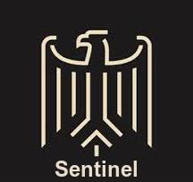

<!-- [![Contributors][contributors-shield]][contributors-url]
[![Forks][forks-shield]][forks-url]
[![Stargazers][stars-shield]][stars-url]
[![Issues][issues-shield]][issues-url]
[![MIT License][license-shield]][license-url]
[![LinkedIn][linkedin-shield]][linkedin-url] -->


<br />
<p align="center">
  <a href="https://github.com/vs666/Sentinel">
    
  </a>

  <h3 align="center">SENTINEL</h3>

  <p align="center">
    A database leak tolerant system.
    <br />
    <a href="https://github.com/vs666/Sentinel/blob/main/docs/DOCS.md"><strong>Explore the docs »</strong></a>
    <br />
    <br />
    <!-- <a href="https://github.com/vs666/Sentinel">View Demo</a> -->
    ·
    <a href="https://github.com/vs666/Sentinel/issues">Report Bug</a>
    ·
    <a href="https://github.com/vs666/Sentinel/issues">Request Feature</a>
  </p>
</p>


<!-- TABLE OF CONTENTS -->
<details open="open">
  <summary><h2 style="display: inline-block">Table of Contents</h2></summary>
  <ol>
    <li>
      <a href="#about-the-project">About The Project</a>
      <ul>
        <li><a href="#built-with">Built With</a></li>
      </ul>
    </li>
    <li>
      <a href="#getting-started">Getting Started</a>
      <ul>
        <li><a href="#prerequisites">Prerequisites</a></li>
        <li><a href="#installation">Installation</a></li>
      </ul>
    </li>
    <li><a href="#usage">Usage</a></li>
    <li><a href="#roadmap">Roadmap</a></li>
    <li><a href="#contributing">Contributing</a></li>
    <li><a href="#license">License</a></li>
    <li><a href="#future-work">Future Work</a></li>
    <li><a href="#contact">Contact</a></li>
    <li><a href="#acknowledgements">Acknowledgements</a></li>
  </ol>
</details>


<!-- ABOUT THE PROJECT -->
## About The Project

[![Product Name Screen Shot][product-screenshot]](https://example.com)

Sentinel is an authentication (Sign-up & Sign-in) system, that claims high tolerance to database leaks, by increasing the complexity of dictionary attacks for cracking passwords.

We aim to be a **B2B Solution**. The first release is aimed towards the Summer Up Hackathon for IIIT Hyderabad. 

### Built With

* [PYTHON 3](https://www.python.org/)
* [REACT JS](https://reactjs.org/)
* [SHELL SCRIPT](https://www.shellscript.sh/)
* :heart:


## Getting Started

First let us start, then we'll tell how to get started.

### Whitepaper 

Coming soon....

### Prerequisites

This is an example of how to list things you need to use the software and how to install them.
* npm
  ```sh
  npm install npm@latest -g
  ```

### Installation

1. Clone the repo
   ```sh
   git clone https://github.com/vs666/Sentinel.git
   ```
2. Install NPM packages (go to web-app folder and then run)
   ```sh
   npm install
   ```
3. Install Python3 packages 
    ```sh
    pip3 install requirements.txt
    ```


## Usage

This code-base is not a library, but needs to be split between different portions of the server ( view whitepaper for the architecture and the setup of the server ). 

_For more examples, please refer to the [Documentation](https://github.com/vs666/Sentinel/blob/main/docs/DOCS.md)_


## Future Work 

In future we aim to release subsequent versions with the following changes : 

v1.1 - Aim to incorporate the option of subscription, (by business clients) to use the server as their authentication service.

v2.0 - Aim to add the feature of fault tolerance (PBFT), when we scale up the protocol to run on distributed server system. Might need to modify the protocol and/or existing code-base a bit.


<!-- ROADMAP -->
## Roadmap

See the [open issues](https://github.com/vs666/Sentinel/issues) for a list of proposed features (and known issues).


<!-- CONTRIBUTING -->
## Contributing

Contributions are what make the open source community such an amazing place to be learn, inspire, and create. Any contributions you make are **greatly appreciated**.

1. Fork the Project
2. Create your Feature Branch (`git checkout -b feature/AmazingFeature`)
3. Commit your Changes (`git commit -m 'Add some AmazingFeature'`)
4. Push to the Branch (`git push origin feature/AmazingFeature`)
5. Open a Pull Request


<!-- LICENSE -->
## License

Distributed under a License with specific instructions for commercial use or distribution. See `LICENSE` for more information.


<!-- CONTACT -->
## Contact

Varul Srivastava    
[@VarulSrivastava](https://twitter.com/VarulSrivastava)   


Project Link: [https://github.com/vs666/Sentinel](https://github.com/vs666/Sentinel)


<!-- MARKDOWN LINKS & IMAGES -->
<!-- https://www.markdownguide.org/basic-syntax/#reference-style-links -->
[contributors-shield]: https://img.shields.io/github/contributors/vs666/Sentinel.svg?style=for-the-badge
[contributors-url]: https://github.com/vs666/Sentinel/graphs/contributors
[forks-shield]: https://img.shields.io/github/forks/vs666/Sentinel.svg?style=for-the-badge
[forks-url]: https://github.com/vs666/Sentinel/network/members
[stars-shield]: https://img.shields.io/github/stars/vs666/repo.svg?style=for-the-badge
[stars-url]: https://github.com/vs666/repo/stargazers
[issues-shield]: https://img.shields.io/github/issues/vs666/repo.svg?style=for-the-badge
[issues-url]: https://github.com/vs666/Sentinel/issues
[license-shield]: https://img.shields.io/github/license/vs666/Sentinel.svg?style=for-the-badge
[license-url]: https://github.com/vs666/Sentinel/blob/main/LICENSE
[linkedin-shield]: https://img.shields.io/badge/-LinkedIn-black.svg?style=for-the-badge&logo=linkedin&colorB=555
[linkedin-url]: https://www.linkedin.com/in/varul-srivastava-497547198/